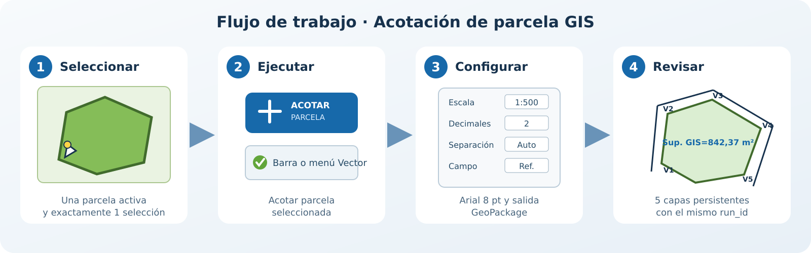
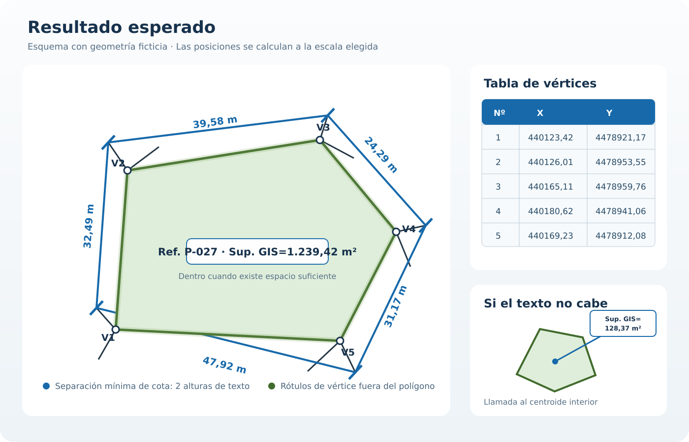

# Acotación de parcela GIS

QGIS plugin for producing complete, persistent parcel dimensioning from one
selected polygon. It is designed for cadastral, land-management and municipal
plans where dimensions, numbered vertices, coordinates and area must remain
stored together.

## Main features

- Creates a dimension for every parcel edge.
- Uses Arial 8 pt labels and enforces a minimum offset of two text heights.
- Creates extension lines and 45-degree end ticks.
- Keeps the real vertex geometry and generates a separate exterior label point.
- Creates an X/Y vertex coordinate table and opens it after processing.
- Places `Sup. GIS=… m²` inside the polygon when it fits.
- Places the area label outside with a leader to an internal centroid when it
  does not fit.
- Optionally includes one source-parcel attribute in the area label.
- Stores every run in `Pacela_result_cotas.gpkg` without deleting earlier runs.

This plugin differs from general-purpose CAD dimensioning tools because it
performs the full parcel workflow in one operation and writes all results to a
persistent GeoPackage instead of temporary memory layers.

## Visual guide

The expected result includes exterior dimensions, numbered vertices, a vertex
coordinate table and an area label. The diagrams use fictional geometry and do
not contain data from the source plan.

## Video tutorial

A short QGIS demonstration can be linked here after it is recorded and
published on YouTube, PeerTube or a GitHub Release. Suggested contents:

1. Select one parcel polygon.
2. Open **Acotar parcela seleccionada**.
3. Set scale, precision, offset and the optional source field.
4. Generate and review the five GeoPackage layers.
5. Save the QGIS project and reopen the persistent result.

## Requirements

- QGIS 3.28 to 3.99.
- A polygon or multipolygon layer.
- A projected CRS whose map units are metres. For Madrid and the supplied plan,
  ETRS89 / UTM zone 30N (EPSG:25830) is recommended.
- No external Python packages or online services are required.

## Use

1. Activate a polygon layer and select exactly one parcel.
2. Click **Acotar parcela seleccionada** in the toolbar or Vector menu.
3. Choose the reference scale, dimension offset, decimal precision and optional
   source field.
4. Select the output location and run the tool.

The resulting GeoPackage contains:

- `parcela_acotada`
- `lineas_cota`
- `tabla_vertices`
- `rotulos_vertices`
- `texto_superficie`

Each operation is identified by `run_id`, allowing multiple results in the same
database.

## Installation from ZIP

Open **Plugins > Manage and Install Plugins > Install from ZIP**, select the
release ZIP and enable the plugin.

The current package can be downloaded from the
[latest GitHub release](https://github.com/motacj/qgis_pacela_cotas/releases/latest).

## Español

Complemento para generar la acotación completa y persistente de una parcela
seleccionada. Crea cotas exteriores, líneas de referencia, trazos, vértices
numerados y desplazados al exterior, tabla de coordenadas X/Y y el texto de
superficie. Si el texto de superficie no cabe dentro, se coloca fuera con una
línea de llamada al centroide interior.

La altura es Arial 8 pt y la distancia mínima entre la arista y la línea de
cota equivale a dos alturas de texto según la escala elegida. Puede añadirse al
rótulo de superficie un campo de la parcela original.

Las imágenes anteriores son esquemas de uso realizados con una geometría
ficticia. Cuando se publique un vídeo real, se enlazará desde la sección
**Video tutorial** sin incorporarlo al ZIP, para mantener el complemento ligero.

Los resultados se guardan en `Pacela_result_cotas.gpkg`; cada ejecución utiliza
un `run_id` y no elimina las anteriores.

## Privacy

The plugin works only with the layers and local files selected by the user. It
does not send data over the network, collect telemetry or require user accounts.

## License

GNU General Public License version 2 or later (`GPL-2.0-or-later`).

## Support and contributions

Use the [issue tracker](https://github.com/motacj/qgis_pacela_cotas/issues) to
report a problem or suggest an improvement. Please read `CONTRIBUTING.md` and
`SECURITY.md` before submitting code or a security report.
